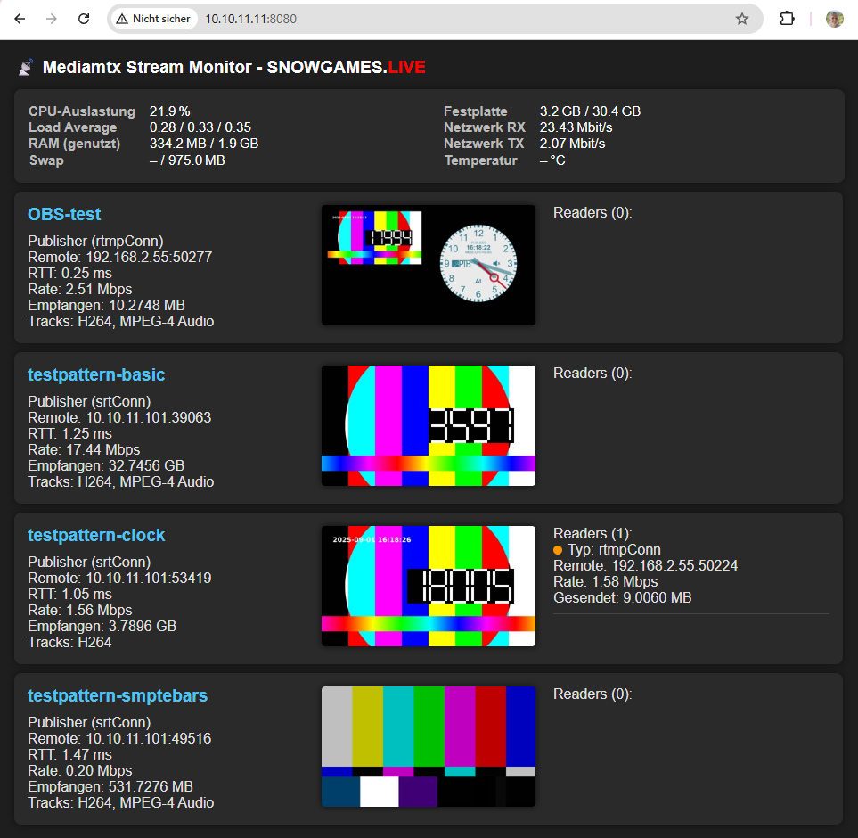

# 📡 MediaMTX Monitor

Ein leichtgewichtiges Monitoring-Tool für [MediaMTX](https://github.com/bluenviron/mediamtx).  
Zeigt aktive Streams, Zuschauerzahlen, Bitraten und Systemmetriken live im Browser – ohne direkte API-Zugriffe durch Clients.

## ✨ Features
- Übersicht aktive Streams & Zuschauer
- SRT-Metriken (RTT, Linkkapazität, Empfangsrate)
- Systemmetriken (CPU, RAM, Netz, Temperatur)
- Einfaches Web-Dashboard und JSON-API
- Modular erweiterbar (Snapshots, Historie, Docker)

## 🚀 Schnellstart
1. MediaMTX installieren und API aktivieren  
2. [Installation ausführen](docs/installation.md)  
3. Dashboard im Browser öffnen → `http://<server>:8080/`

## 📚 Weitere Infos
- [📄 installation.md](docs/installation.md) – Schritt-für-Schritt Einrichtung
- [📖 documentation.md](docs/documentation.md) – Details für Anwender & Entwickler
- [🏗️ architecture.md](docs/architecture.md) – Architektur & Designüberblick
