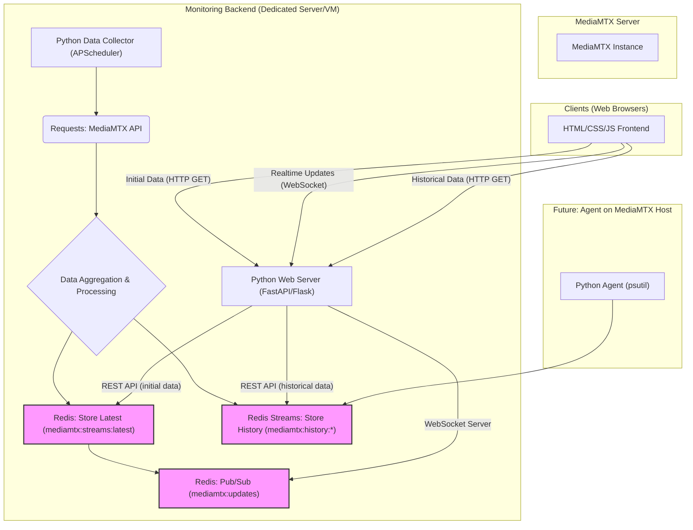

# 📡 MediaMTX Stream Monitoring

## 🔎 Was macht dieses Projekt?

Dieses Projekt hilft dir, deinen **MediaMTX-Server** einfach und übersichtlich zu überwachen. Du siehst in Echtzeit:
- welche Streams aktiv sind,
- wie viele Daten übertragen werden,
- wie viele Zuschauer (Reader) verbunden sind,
- und bei SRT-Streams zusätzlich wichtige Werte wie RTT und Bandbreite.

So hast du immer den aktuellen Zustand deiner MediaMTX-Instanz im Blick – ohne den Server durch viele einzelne Anfragen zu belasten.

---

## 🛠️ Wie funktioniert es?

Das Monitoring besteht aus drei Bausteinen:

✅ **Backend (Python)**  
- Fragt alle 2 Sekunden die MediaMTX-API ab (`/v3/paths/list` und `/v3/srtconns/list`).
- Verarbeitet die Daten und speichert sie in **Redis**.
- Benachrichtigt alle verbundenen Browser über WebSockets, wenn es neue Daten gibt.

✅ **Redis**  
- Speichert den aktuellen Zustand der Streams.
- Kann auch historische Daten (z. B. RTT-Verlauf) speichern, damit du später Trends analysieren kannst.

✅ **Frontend (Browser)**  
- Lädt beim Start die aktuellen Daten vom Backend.
- Verbindet sich per **WebSocket**, um automatisch aktuelle Infos zu erhalten.
- Zeigt die Daten übersichtlich in Tabellen oder Diagrammen an.

---

## 🏗️ Warum dieser Aufbau?

- Das Backend fragt den MediaMTX-Server nur **einmal** ab, egal wie viele Clients verbunden sind.  
  → Das entlastet den MediaMTX-Server und spart Ressourcen.
- Die Clients müssen **nicht direkt auf den MediaMTX-Server zugreifen**, sondern nur auf das Backend.  
  → Das erhöht die Sicherheit, da du die MediaMTX-API nicht öffentlich zugänglich machen musst.
- Du kannst **beliebig viele Clients** anschließen, ohne den MediaMTX-Server stärker zu belasten.
- Du kannst später leicht neue Features ergänzen, z. B. Speicherung von Langzeit-Daten oder Anzeige der Server-Auslastung (CPU, RAM, Netzwerk).

---

## ⚙️ So ist das System aufgebaut

```scss
+-------------------+
|  MediaMTX-Server  |
|  (streaming API)  |
+---------+---------+
          │
          │
+---------▼---------+
|      Backend      |
| (Python Script &  |
|    Redis Cache)   |
+---------+---------+
          │
          │
+---------▼---------+
|      Clients      |
| (Browser Dashboard|
|   mit HTML/JS)    |
+-------------------+

```




- Das **Backend** sammelt die Daten.
- Es speichert sie in Redis und informiert alle Clients per WebSocket.
- Die **Clients** verbinden sich nur mit dem Backend und zeigen die Daten an.

---

## 📊 Welche Daten werden überwacht?

- Name des Streams (`name`)
- Quelle des Streams (`sourceType`, z. B. srtConn)
- Übertragene Bytes (`bytesReceived`)
- Anzahl der Zuschauer (`readers`)
- Bei SRT-Streams zusätzlich:
  - RTT (`msRTT`)
  - Empfangsrate (`mbpsReceiveRate`)
  - Link-Kapazität (`mbpsLinkCapacity`)

---

## 🚀 Geplante Entwicklungsschritte

1️⃣ **Basis-Backend**  
   - Holt aktuelle Daten vom MediaMTX-Server.
   - Speichert sie in Redis.

2️⃣ **WebSocket-Backend + Frontend**  
   - Erstellt ein Dashboard im Browser.
   - Stellt eine WebSocket-Verbindung her, um aktuelle Daten in Echtzeit anzuzeigen.

3️⃣ **Historische Daten**  
   - Speichert historische Metriken in Redis Streams.
   - Zeigt den Verlauf (z. B. RTT oder Bandbreite) im Frontend als Diagramm an.

4️⃣ **Server-Metriken (später)**  
   - Ein kleiner Agent auf dem MediaMTX-Host erfasst CPU-, RAM- und Netzwerk-Auslastung.
   - Diese Daten werden im Dashboard angezeigt.

---

## Komponenten im Detail:

* **MediaMTX Server:** Die zu überwachende MediaMTX-Instanz. Sie stellt lediglich ihre `v3/paths/list` und `v3/srtconns/list` API-Endpunkte bereit.

* **Monitoring Backend:**
    * **Python Data Collector:** Ein Python-Skript, das mittels **[APScheduler](https://apscheduler.readthedocs.io/)** alle 2 Sekunden die MediaMTX-API abfragt. Es aggregiert die Daten und speichert den aktuellen Zustand sowie relevante historische Datenpunkte in Redis.
    * **Redis:** Dient als Hochleistungs-Datenspeicher.
        * Speichert den **neuesten aggregierten Zustand** für schnelle Zugriffe (`mediamtx:streams:latest`).
        * Nutzt **[Redis Streams](https://redis.io/docs/data-types/streams/)** zur effizienten Speicherung von Zeitreihendaten für historische Analysen (z.B. RTT-Verlauf, Bandbreitennutzung).
        * Verwendet das **[Pub/Sub-Muster](https://redis.io/docs/manual/pubsub/)**, um angeschlossene Clients über neue Daten zu informieren.
    * **Python Web Server ([FastAPI](https://fastapi.tiangolo.com/) oder [Flask](https://flask.palletsprojects.com/)):** Stellt die Web-Oberfläche und API-Endpunkte bereit.
        * Bietet einen **REST-API-Endpunkt** für den initialen Abruf der aktuellen Daten durch die Clients.
        * Implementiert einen **WebSocket-Server**, der sich bei Redis Pub/Sub anmeldet und bei Datenaktualisierungen die neuesten Informationen an alle verbundenen Web-Clients pusht.
        * Stellt **REST-API-Endpunkte** für den Abruf historischer Daten aus Redis Streams bereit.

* **Clients (Web Browser):**
    * Ein schlankes Frontend, entwickelt mit **HTML, CSS und JavaScript**.
    * Ruft initial die aktuellen Daten über HTTP ab.
    * Establishiert eine **WebSocket-Verbindung** für Echtzeit-Updates.
    * Kann historische Daten über weitere HTTP-Anfragen abrufen und in Diagrammen oder Tabellen visualisieren (ggf. mit Bibliotheken wie **[Chart.js](https://www.chartjs.org/)**).

* **Zukünftiger Agent auf MediaMTX Host:** Ein optionaler, sehr leichtgewichtiger Python-Agent (z.B. basierend auf **[psutil](https://psutil.readthedocs.io/)**), der direkt auf dem MediaMTX-Host läuft und Systemmetriken (CPU, RAM, Netzwerk I/O) erfasst und diese ebenfalls in Redis Streams im Backend speichert.

---

## Geplante Entwicklungsschritte

1.  **Phase 1: Basis-Backend mit Echtzeit-Aggregation und Redis-Speicherung (aktuellste Daten)**
    * Implementierung des Python-Skripts zum Abfragen und Aggregieren der MediaMTX-API-Daten.
    * Integration von `APScheduler` für das 2-Sekunden-Intervall.
    * Speicherung der aggregierten Daten in Redis (`mediamtx:streams:latest`).
    * Redis Pub/Sub-Integration für Benachrichtigungen.
2.  **Phase 2: WebSocket-Backend und einfaches Web-Frontend**
    * Einrichtung eines FastAPI (oder Flask) Web-Servers mit WebSocket-Unterstützung.
    * Entwicklung des HTML/CSS/JS-Frontends zur Anzeige der Echtzeit-Daten.
3.  **Phase 3: Historische Daten in Redis Streams**
    * Erweiterung des Data Collectors um die Speicherung relevanter Metriken in Redis Streams (`mediamtx:history:*`).
    * Implementierung von REST-API-Endpunkten im Backend zum Abrufen historischer Daten.
    * Anpassung des Frontends zur Visualisierung historischer Zeitreihen (z.B. mit Chart.js).
4.  **Phase 4: Server-Metriken-Agent (zukünftig)**
    * Entwicklung eines kleinen Python-Agenten (psutil-basiert) zur Erfassung von Host-Metriken.
    * Integration dieser Metriken in Redis Streams.
    * Anpassung von Backend und Frontend zur Anzeige dieser neuen Daten.

---

## Erste Schritte (für Entwickler)

Detaillierte Anleitungen zur Installation der Abhängigkeiten und zum Start der verschiedenen Komponenten (Backend, Redis, Frontend) werden in Kürze hier hinzugefügt.
