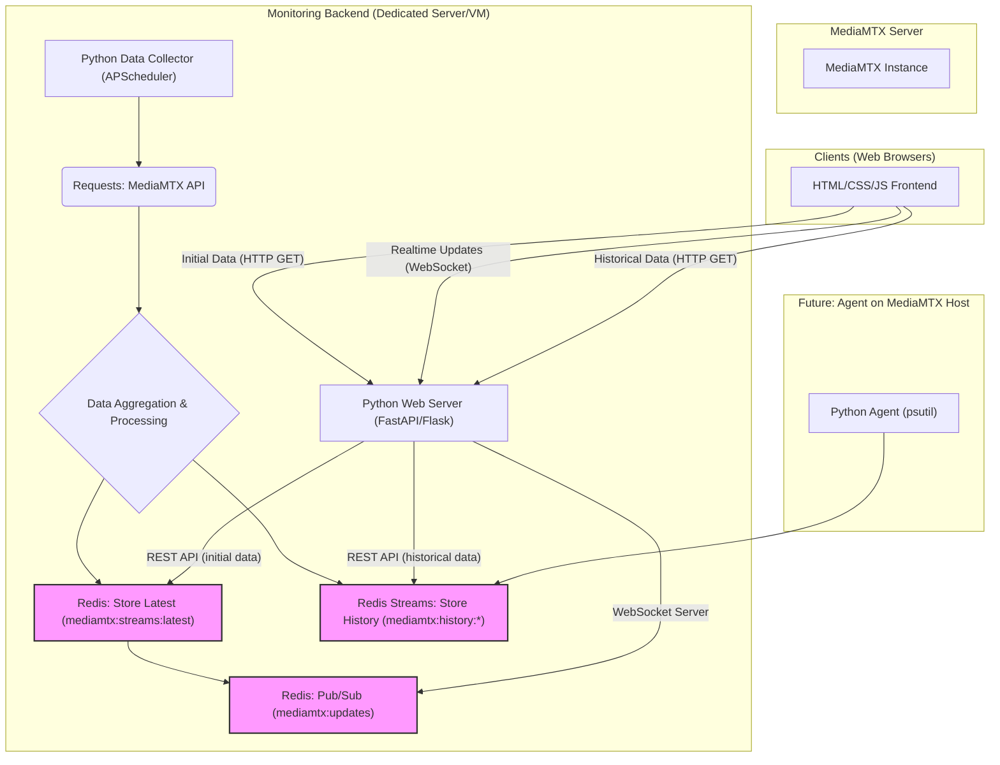

# 📡 MediaMTX Stream & Server Monitoring

## Projektübersicht

Dieses Projekt bietet eine umfassende Monitoring-Lösung für MediaMTX-Server, die sowohl Echtzeit-Stream-Metriken (Pfade, SRT-Verbindungen, RTT, Bandbreite) als auch zukünftig Server-Ressourcennutzung (CPU, RAM, Netzwerk I/O) erfasst. Ziel ist es, Administratoren einen klaren und aktuellen Überblick über den Zustand ihrer MediaMTX-Instanzen zu geben, ohne den MediaMTX-Server selbst unnötig zu belasten.

Die Lösung besteht aus einem robusten Backend, das Daten sammelt und persistent speichert, sowie einem schlanken Web-Frontend für die Visualisierung in Echtzeit und die Analyse historischer Trends.

## Kernfunktionen

* **Echtzeit-Stream-Metriken:** Überwachung von `paths`, `bytesReceived`, `readers`, `sourceType`, sowie spezifischen SRT-Metriken wie `msRTT`, `mbpsReceiveRate`, `mbpsLinkCapacity`.
* **Historische Datenhaltung:** Speicherung relevanter Metriken in einer performanten Datenbank (Redis Streams) für Langzeitanalyse und Trendvisualisierung (z.B. RTT-Schwankungen, Bandbreitennutzung).
* **Minimaler Impact auf MediaMTX:** Die gesamte Aggregations- und Verarbeitungslogik findet auf einem dedizierten Backend-Server statt, um den MediaMTX-Server so wenig wie möglich zu belasten.
* **Echtzeit-Updates:** Push-Benachrichtigungen an die Web-Clients mittels WebSockets sorgen für eine sofortige Aktualisierung der angezeigten Daten.
* **Zukünftige Erweiterungen:** Integration von allgemeinen Server-Metriken (CPU-Last, Speichernutzung, Netzwerk-Bandbreite) direkt vom MediaMTX-Host.

## Architektur

Die Lösung ist modular aufgebaut und gliedert sich in folgende Hauptkomponenten:

