# 📡 MediaMTX Stream Monitoring

## 🔎 Was macht dieses Projekt?

Dieses Projekt hilft dir, deinen **MediaMTX-Server** einfach und übersichtlich zu überwachen. Du siehst in Echtzeit:
- welche Streams aktiv sind,
- wie viele Daten übertragen werden,
- wie viele Zuschauer (Reader) verbunden sind,
- und bei SRT-Streams zusätzlich wichtige Werte wie RTT und Bandbreite.

So hast du immer den aktuellen Zustand deiner MediaMTX-Instanz im Blick – ohne den Server durch viele einzelne Anfragen zu belasten.

---

## 🛠️ Wie funktioniert es?

Das Monitoring besteht aus drei Bausteinen:

✅ **Backend (Python)**  
- Fragt alle 2 Sekunden die MediaMTX-API ab (`/v3/paths/list` und `/v3/srtconns/list`).
- Verarbeitet die Daten und speichert sie in **Redis**.
- Benachrichtigt alle verbundenen Browser über WebSockets, wenn es neue Daten gibt.

✅ **Redis**  
- Speichert den aktuellen Zustand der Streams.
- Kann auch historische Daten (z. B. RTT-Verlauf) speichern, damit du später Trends analysieren kannst.

✅ **Frontend (Browser)**  
- Lädt beim Start die aktuellen Daten vom Backend.
- Verbindet sich per **WebSocket**, um automatisch aktuelle Infos zu erhalten.
- Zeigt die Daten übersichtlich in Tabellen oder Diagrammen an.

---

## 🏗️ Warum dieser Aufbau?

- Das Backend fragt den MediaMTX-Server nur **einmal** ab, egal wie viele Clients verbunden sind.  
  → Das entlastet den MediaMTX-Server und spart Ressourcen.
- Die Clients müssen **nicht direkt auf den MediaMTX-Server zugreifen**, sondern nur auf das Backend.  
  → Das erhöht die Sicherheit, da du die MediaMTX-API nicht öffentlich zugänglich machen musst.
- Du kannst **beliebig viele Clients** anschließen, ohne den MediaMTX-Server stärker zu belasten.
- Du kannst später leicht neue Features ergänzen, z. B. Speicherung von Langzeit-Daten oder Anzeige der Server-Auslastung (CPU, RAM, Netzwerk).

---

## ⚙️ So ist das System aufgebaut

```scss
+-------------------+
|  MediaMTX-Server  |
|  (streaming API)  |
+---------+---------+
          │
          │
+---------▼---------+
|      Backend      |
| (Python Script &  |
|    Redis Cache)   |
+---------+---------+
          │
          │
+---------▼---------+
|      Clients      |
| (Browser Dashboard|
|   mit HTML/JS)    |
+-------------------+

```

```mermaid
graph TD
    subgraph "MediaMTX Server"
        MMT["MediaMTX Instance"]
    end

    subgraph "Monitoring Backend (Dedicated Server/VM)"
        A["Python Data Collector (APScheduler)"] --> B("Requests: MediaMTX API")
        B --> C{"Data Aggregation & Processing"}
        C --> D["Redis: Store Latest (mediamtx:streams:latest)"]
        C --> E["Redis Streams: Store History (mediamtx:history:*)"]
        D --> F["Redis: Pub/Sub (mediamtx:updates)"]

        G["Python Web Server (FastAPI/Flask)"] -- "REST API (initial data)" --> D
        G -- "WebSocket Server" --> F
        G -- "REST API (historical data)" --> E
    end

    subgraph "Clients (Web Browsers)"
        H["HTML/CSS/JS Frontend"] -- "Initial Data (HTTP GET)" --> G
        H -- "Realtime Updates (WebSocket)" --> G
        H -- "Historical Data (HTTP GET)" --> G
    end

    subgraph "Future: Agent on MediaMTX Host"
        I["Python Agent (psutil)"] --> E
    end

    style D fill:#f9f,stroke:#333,stroke-width:2px
    style E fill:#f9f,stroke:#333,stroke-width:2px
    style F fill:#f9f,stroke:#333,stroke-width:2px
```


### Ablauf auf einen Blick:

Das **Backend** holt die Daten → speichert sie in Redis → sendet Updates per WebSocket an alle Clients.
Die **Clients** müssen nur das Backend kennen – nicht MediaMTX selbst.
Das entlastet den MediaMTX-Server und sichert ihn gleichzeitig ab.

---

## 📊 Welche Daten werden überwacht?

- Name des Streams (`name`)
- Quelle des Streams (`sourceType`, z. B. srtConn)
- Übertragene Bytes (`bytesReceived`)
- Anzahl der Zuschauer (`readers`)
- Bei SRT-Streams zusätzlich:
  - RTT (`msRTT`)
  - Empfangsrate (`mbpsReceiveRate`)
  - Link-Kapazität (`mbpsLinkCapacity`)

---

## 🚀 Entwicklung in Phasen

1️⃣ **Phase 1 – Basis-Backend**  
   - Holt aktuelle Daten und speichert sie in Redis.
   - Schickt Benachrichtigungen über Pub/Sub.

2️⃣ **Phase 2 – WebSocket & Frontend**  
   - WebSocket-Server und HTML/JS-Dashboard für Live-Anzeige.

3️⃣ **Phase 3 – Historische Daten**  
   - Speicherung und Abruf von Zeitreihen aus Redis Streams.
   - Frontend-Visualisierung mit Diagrammen.

4️⃣ **Phase 4 – Server-Metriken-Agent (optional)**  
   - Kleiner Python-Agent überwacht CPU, RAM und Netzwerk auf dem MediaMTX-Host.
   - Anzeige der Metriken im Dashboard.

---
## 🔧 Komponenten im Detail

### MediaMTX Server
- Stellt die API-Endpunkte `/v3/paths/list` und `/v3/srtconns/list` bereit.
- Muss nicht öffentlich erreichbar sein, wenn das Backend auf demselben Netzwerk läuft.

### Monitoring Backend
- **Python Data Collector (APScheduler):**
  - Fragt MediaMTX alle 2 Sekunden ab.
  - Aggregiert und speichert die Daten in Redis.
- **Redis:**
  - Speichert aktuelle Daten (`mediamtx:streams:latest`).
  - Hält historische Daten in **Redis Streams**.
  - Benutzt **Pub/Sub**, um Clients bei neuen Daten zu informieren.
- **Python Web Server (FastAPI/Flask):**
  - Bietet REST-API-Endpunkte.
  - Stellt einen WebSocket-Server bereit.
  - Verteilt Echtzeit-Updates und historische Daten an die Clients.

### Clients (Web Browser)
- HTML/JS-Frontend mit WebSocket-Anbindung.
- Holt initiale Daten über HTTP.
- Visualisiert aktuelle und historische Daten (z. B. mit Chart.js).

### Optional: Agent auf dem MediaMTX-Host
- Kleines Python-Skript mit **psutil**.
- Erfasst CPU, RAM und Netzwerk.
- Schickt die Daten an Redis für die Anzeige im Dashboard.

---

## Geplante Entwicklungsschritte

1.  **Phase 1: Basis-Backend mit Echtzeit-Aggregation und Redis-Speicherung (aktuellste Daten)**
    * Implementierung des Python-Skripts zum Abfragen und Aggregieren der MediaMTX-API-Daten.
    * Integration von `APScheduler` für das 2-Sekunden-Intervall.
    * Speicherung der aggregierten Daten in Redis (`mediamtx:streams:latest`).
    * Redis Pub/Sub-Integration für Benachrichtigungen.
2.  **Phase 2: WebSocket-Backend und einfaches Web-Frontend**
    * Einrichtung eines FastAPI (oder Flask) Web-Servers mit WebSocket-Unterstützung.
    * Entwicklung des HTML/CSS/JS-Frontends zur Anzeige der Echtzeit-Daten.
3.  **Phase 3: Historische Daten in Redis Streams**
    * Erweiterung des Data Collectors um die Speicherung relevanter Metriken in Redis Streams (`mediamtx:history:*`).
    * Implementierung von REST-API-Endpunkten im Backend zum Abrufen historischer Daten.
    * Anpassung des Frontends zur Visualisierung historischer Zeitreihen (z.B. mit Chart.js).
4.  **Phase 4: Server-Metriken-Agent (zukünftig)**
    * Entwicklung eines kleinen Python-Agenten (psutil-basiert) zur Erfassung von Host-Metriken.
    * Integration dieser Metriken in Redis Streams.
    * Anpassung von Backend und Frontend zur Anzeige dieser neuen Daten.

---

## 🚦 Erste Schritte (für Entwickler)

Die detaillierte Anleitung zur Installation, Einrichtung und zum Starten von Backend, Redis und Frontend folgt bald hier.  
Bleib dran – dieses Projekt wächst ständig weiter! 🚀

