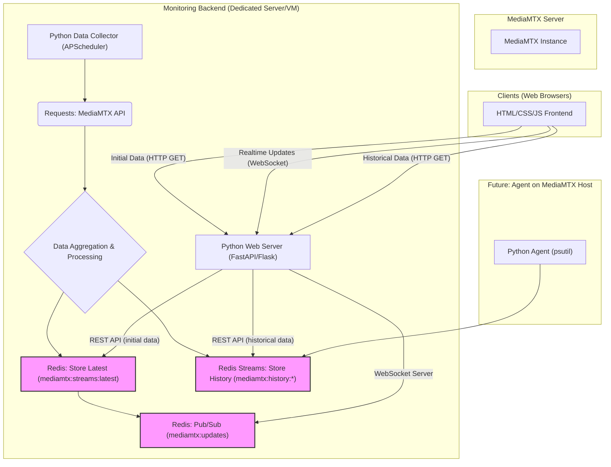

# 📡 MediaMTX Stream & Server Monitoring

## Projektübersicht

Dieses Projekt bietet eine umfassende Monitoring-Lösung für MediaMTX-Server, die sowohl Echtzeit-Stream-Metriken (Pfade, SRT-Verbindungen, RTT, Bandbreite) als auch zukünftig Server-Ressourcennutzung (CPU, RAM, Netzwerk I/O) erfasst. Ziel ist es, Administratoren einen klaren und aktuellen Überblick über den Zustand ihrer MediaMTX-Instanzen zu geben, ohne den MediaMTX-Server selbst unnötig zu belasten.

Die Lösung besteht aus einem robusten Backend, das Daten sammelt und persistent speichert, sowie einem schlanken Web-Frontend für die Visualisierung in Echtzeit und die Analyse historischer Trends.

## Kernfunktionen

* **Echtzeit-Stream-Metriken:** Überwachung von `paths`, `bytesReceived`, `readers`, `sourceType`, sowie spezifischen SRT-Metriken wie `msRTT`, `mbpsReceiveRate`, `mbpsLinkCapacity`.
* **Historische Datenhaltung:** Speicherung relevanter Metriken in einer performanten Datenbank (Redis Streams) für Langzeitanalyse und Trendvisualisierung (z.B. RTT-Schwankungen, Bandbreitennutzung).
* **Minimaler Impact auf MediaMTX:** Die gesamte Aggregations- und Verarbeitungslogik findet auf einem dedizierten Backend-Server statt, um den MediaMTX-Server so wenig wie möglich zu belasten.
* **Echtzeit-Updates:** Push-Benachrichtigungen an die Web-Clients mittels WebSockets sorgen für eine sofortige Aktualisierung der angezeigten Daten.
* **Zukünftige Erweiterungen:** Integration von allgemeinen Server-Metriken (CPU-Last, Speichernutzung, Netzwerk-Bandbreite) direkt vom MediaMTX-Host.

## Architektur

Die Lösung ist modular aufgebaut und gliedert sich in folgende Hauptkomponenten:

### Komponenten im Detail:

* **MediaMTX Server:** Die zu überwachende MediaMTX-Instanz. Sie stellt lediglich ihre `v3/paths/list` und `v3/srtconns/list` API-Endpunkte bereit.

* **Monitoring Backend:**
    * **Python Data Collector:** Ein Python-Skript, das mittels **[APScheduler](https://apscheduler.readthedocs.io/)** alle 2 Sekunden die MediaMTX-API abfragt. Es aggregiert die Daten und speichert den aktuellen Zustand sowie relevante historische Datenpunkte in Redis.
    * **Redis:** Dient als Hochleistungs-Datenspeicher.
        * Speichert den **neuesten aggregierten Zustand** für schnelle Zugriffe (`mediamtx:streams:latest`).
        * Nutzt **[Redis Streams](https://redis.io/docs/data-types/streams/)** zur effizienten Speicherung von Zeitreihendaten für historische Analysen (z.B. RTT-Verlauf, Bandbreitennutzung).
        * Verwendet das **[Pub/Sub-Muster](https://redis.io/docs/manual/pubsub/)**, um angeschlossene Clients über neue Daten zu informieren.
    * **Python Web Server ([FastAPI](https://fastapi.tiangolo.com/) oder [Flask](https://flask.palletsprojects.com/)):** Stellt die Web-Oberfläche und API-Endpunkte bereit.
        * Bietet einen **REST-API-Endpunkt** für den initialen Abruf der aktuellen Daten durch die Clients.
        * Implementiert einen **WebSocket-Server**, der sich bei Redis Pub/Sub anmeldet und bei Datenaktualisierungen die neuesten Informationen an alle verbundenen Web-Clients pusht.
        * Stellt **REST-API-Endpunkte** für den Abruf historischer Daten aus Redis Streams bereit.

* **Clients (Web Browser):**
    * Ein schlankes Frontend, entwickelt mit **HTML, CSS und JavaScript**.
    * Ruft initial die aktuellen Daten über HTTP ab.
    * Establishiert eine **WebSocket-Verbindung** für Echtzeit-Updates.
    * Kann historische Daten über weitere HTTP-Anfragen abrufen und in Diagrammen oder Tabellen visualisieren (ggf. mit Bibliotheken wie **[Chart.js](https://www.chartjs.org/)**).

* **Zukünftiger Agent auf MediaMTX Host:** Ein optionaler, sehr leichtgewichtiger Python-Agent (z.B. basierend auf **[psutil](https://psutil.readthedocs.io/)**), der direkt auf dem MediaMTX-Host läuft und Systemmetriken (CPU, RAM, Netzwerk I/O) erfasst und diese ebenfalls in Redis Streams im Backend speichert.

---

## Geplante Entwicklungsschritte

1.  **Phase 1: Basis-Backend mit Echtzeit-Aggregation und Redis-Speicherung (aktuellste Daten)**
    * Implementierung des Python-Skripts zum Abfragen und Aggregieren der MediaMTX-API-Daten.
    * Integration von `APScheduler` für das 2-Sekunden-Intervall.
    * Speicherung der aggregierten Daten in Redis (`mediamtx:streams:latest`).
    * Redis Pub/Sub-Integration für Benachrichtigungen.
2.  **Phase 2: WebSocket-Backend und einfaches Web-Frontend**
    * Einrichtung eines FastAPI (oder Flask) Web-Servers mit WebSocket-Unterstützung.
    * Entwicklung des HTML/CSS/JS-Frontends zur Anzeige der Echtzeit-Daten.
3.  **Phase 3: Historische Daten in Redis Streams**
    * Erweiterung des Data Collectors um die Speicherung relevanter Metriken in Redis Streams (`mediamtx:history:*`).
    * Implementierung von REST-API-Endpunkten im Backend zum Abrufen historischer Daten.
    * Anpassung des Frontends zur Visualisierung historischer Zeitreihen (z.B. mit Chart.js).
4.  **Phase 4: Server-Metriken-Agent (zukünftig)**
    * Entwicklung eines kleinen Python-Agenten (psutil-basiert) zur Erfassung von Host-Metriken.
    * Integration dieser Metriken in Redis Streams.
    * Anpassung von Backend und Frontend zur Anzeige dieser neuen Daten.

---

## Erste Schritte (für Entwickler)

Detaillierte Anleitungen zur Installation der Abhängigkeiten und zum Start der verschiedenen Komponenten (Backend, Redis, Frontend) werden in Kürze hier hinzugefügt.
