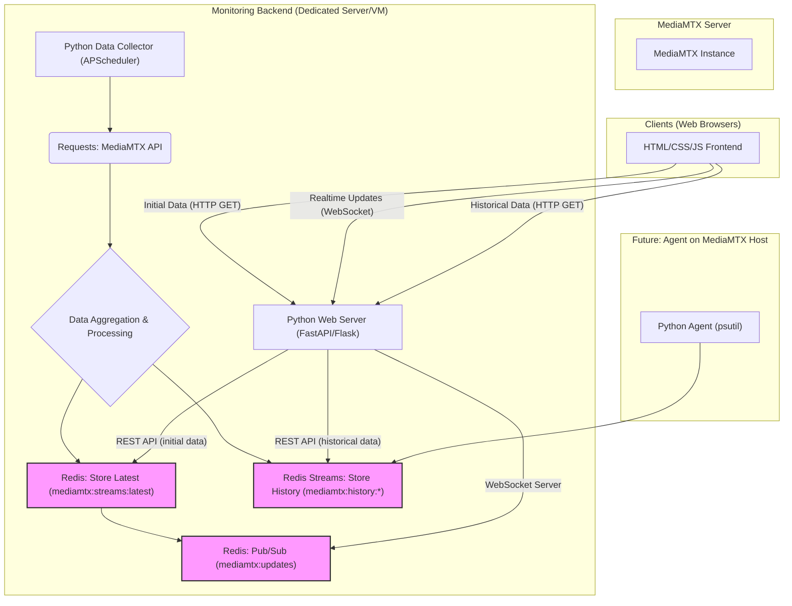

# 📡 MediaMTX Stream Monitoring

Ein leichtgewichtiges Monitoring-Tool für MediaMTX-Server (vormals `rtsp-simple-server`). Zeigt aktive Streams, Zuschauerzahlen, Bitraten und SRT-Metriken übersichtlich im Browser an – ohne direkte API-Zugriffe durch Clients.

## 🎯 Ziel

- **Übersicht:** Aktive Streams und Live-Metriken auf einen Blick
- **Effizienz:** MediaMTX-API wird nur einmal zentral abgefragt
- **Sicherheit:** Clients benötigen keinen Zugang zur MediaMTX-Instanz
- **Modularität:** Einfach erweiterbar für historische Daten oder Servermetriken

## 🧱 Architektur

- **Python Collector:** fragt regelmäßig die MediaMTX-API ab
- **Redis:** speichert aktuelle (und künftig historische) Daten
- **FastAPI:** liefert JSON-API, WebSockets und statische HTML/JS-Seiten
- **Browser-Frontend:** zeigt Daten live und responsiv an

```plain
+-------------+      +------------+      +---------+      +--------------+
| MediaMTX    +----> | Collector  +----> | Redis   +<---->+  Webserver   |
| (API)       |      | (Python)   |      | Cache   |      | (FastAPI)    |
+-------------+      +------------+      +---------+      +------+-------+
                                                               |
                                                               v
                                                       +--------+--------+
                                                       |   Web Frontend  |
                                                       +-----------------+

```

### 🛠️ Wie funktioniert es?

Das Monitoring besteht aus drei Bausteinen:

✅ **Backend (Python)**  
- Fragt alle 2 Sekunden die MediaMTX-API ab (`/v3/paths/list` und `/v3/srtconns/list`).
- Verarbeitet die Daten und speichert sie in **Redis**.
- Benachrichtigt alle verbundenen Browser über WebSockets, wenn es neue Daten gibt.

✅ **Redis**  
- Speichert den aktuellen Zustand der Streams.
- Kann auch historische Daten (z. B. RTT-Verlauf) speichern, damit du später Trends analysieren kannst.

✅ **Frontend (Browser)**  
- Lädt beim Start die aktuellen Daten vom Backend.
- Verbindet sich per **WebSocket**, um automatisch aktuelle Infos zu erhalten.
- Zeigt die Daten übersichtlich in Tabellen oder Diagrammen an.

### 🏗️ Warum dieser Aufbau?

- Das Backend fragt den MediaMTX-Server nur **einmal** ab, egal wie viele Clients verbunden sind.  
  → Das entlastet den MediaMTX-Server und spart Ressourcen.
- Die Clients müssen **nicht direkt auf den MediaMTX-Server zugreifen**, sondern nur auf das Backend.  
  → Das erhöht die Sicherheit, da du die MediaMTX-API nicht öffentlich zugänglich machen musst.
- Du kannst **beliebig viele Clients** anschließen, ohne den MediaMTX-Server stärker zu belasten.
- Du kannst später leicht neue Features ergänzen, z. B. Speicherung von Langzeit-Daten oder Anzeige der Server-Auslastung (CPU, RAM, Netzwerk).

## 🚀 Erste Schritte
👉 Für Setup, Code-Struktur und geplante Erweiterungen siehe [📄 BasisBackend.md](BasisBackend.md)


### 🔧 Toolchain
- Python 3.11
- FastAPI + Uvicorn
- Redis
- HTML, CSS, Vanilla JS (optional Chart.js)

### 📂 Struktur
```plaintext
bin/
  mediamtx_collector.py     ← Datensammler (MediaMTX → Redis)
  mediamtx_api.py           ← FastAPI-Server (JSON + Web + WebSocket)
static/
  index.html                ← Web-Frontend
  style.css, app.js         ← Darstellung & WebSocket-Handling
BasisBackend.md             ← Detaillierte technische Beschreibung
README.md                   ← Dieses Dokument
```

---

## 📌 Status

✅ Live-Ansicht der aktiven Streams

🔜 Historie (Redis Streams)

🔜 Servermetriken (CPU, RAM, Netz)

---

## ⚙️ Ideen



## 📚 Dokumentation

- [README.md – Übersicht](README.md)
- [BasisBackend.md – Architektur & Einrichtung](BasisBackend.md)

