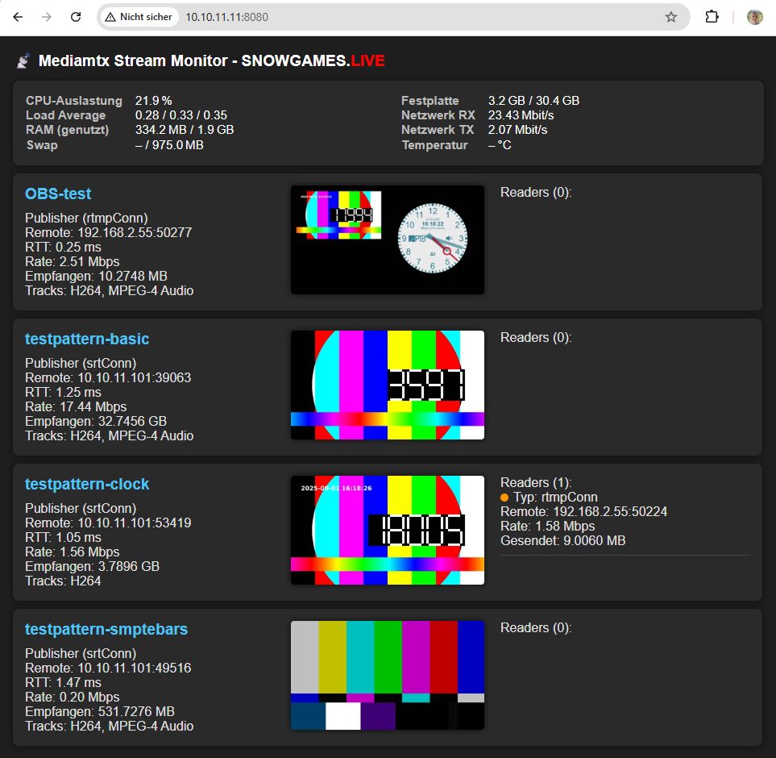

# 📡 MediaMTX Monitor


Ein leichtgewichtiges Monitoring-Tool für [MediaMTX](https://github.com/bluenviron/mediamtx) mit Web-Dashboard und Redis-Backend.  

## Zweck

Das Projekt sammelt aktuelle Streamdaten von MediaMTX, ergänzt sie um berechnete Werte wie Bitraten und SRT-Metriken und stellt alles über ein einfaches Web-Dashboard bereit.



## Aktueller Funktionsumfang

- Anzeige aktiver Streams
- Anzeige verbundener Reader
- SRT-Metriken wie RTT und Datenrate
- Systemmetriken des Hosts (CPU, RAM, Disk, Netzwerk, Temperatur)
- REST-API für Frontend und CLI-Tests
- Statisches Web-Frontend ohne direkte Browser-Zugriffe auf die MediaMTX-API

## Architektur in Kurzform

MediaMTX API → Collector → Redis → FastAPI → Browser

## Voraussetzungen

- Linux-Server (Debian, Ubuntu oder Raspberry Pi OS)
- Installiertes MediaMTX mit aktivierter API
- Python 3
- Redis

## 🚀 Schnellstart
1. MediaMTX installieren und API aktivieren  
2. [Installation ausführen](docs/installation.md)

```bash
wget https://raw.githubusercontent.com/richtertoralf/mediamtxMonitor/main/install.sh
chmod +x install.sh
sudo ./install.sh
```

4.Danach ist das Dashboard unter folgendem Port bzw. im Browser erreichbar: → `http://<server>:8080/`

## Hinweise

- Die Basisfunktion des Projekts ist Stream- und Systemmonitoring.
- Vorschaustreams oder Snapshot-Mechanismen sind installationsspezifisch und nicht Voraussetzung für den Grundbetrieb.
- Das Installationsskript aktualisiert ein bestehendes Checkout per Git und verwirft dabei lokale Änderungen.

## 📚 Weitere Infos / Dokumentation
- [📄 installation.md](docs/installation.md) – Schritt-für-Schritt Einrichtung
- [📖 documentation.md](docs/documentation.md) – Details für Anwender & Entwickler
- [🏗️ architecture.md](docs/architecture.md) – Architektur & Designüberblick
