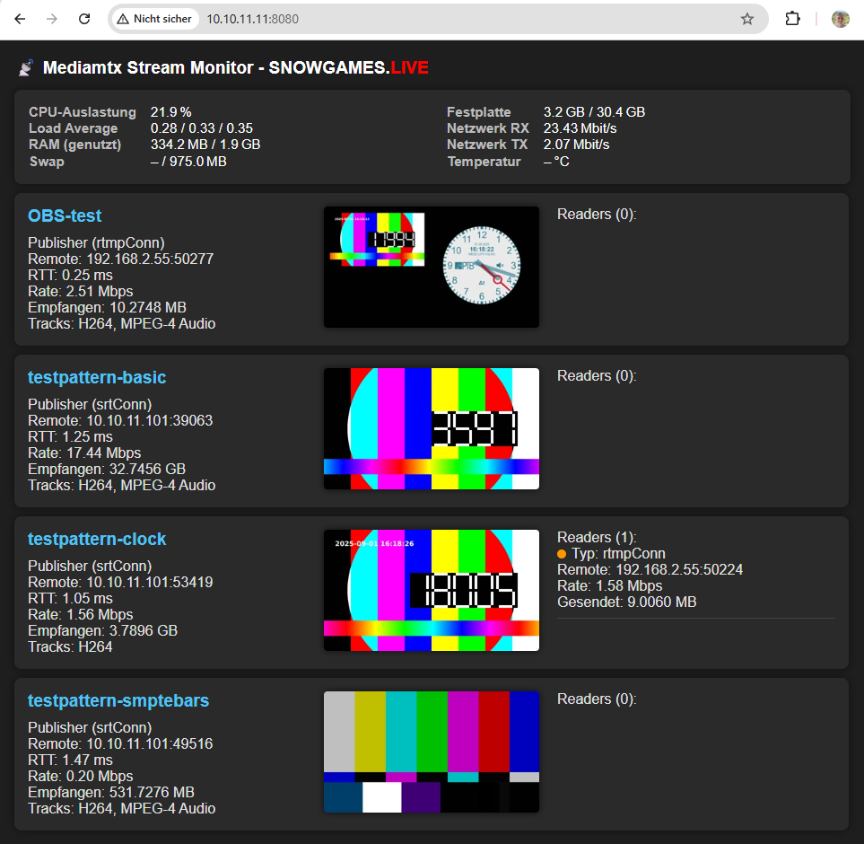

# 📡 MediaMTX Monitor


Ein leichtgewichtiges Monitoring-Tool für [MediaMTX](https://github.com/bluenviron/mediamtx) mit Web-Dashboard und Redis-Backend.  

## Zweck

Das Projekt sammelt aktuelle Streamdaten von MediaMTX, ergänzt sie um berechnete Werte wie Bitraten und SRT-Metriken und stellt alles über ein einfaches Web-Dashboard bereit.



## Motivation

MediaMTX Monitor entstand aus dem praktischen Bedarf, mehrere Live-Streams bei Sportproduktionen zuverlässig zu überwachen. Die Grundidee ist von professionellen Broadcast-Monitoring-Werkzeugen inspiriert: Alle relevanten Streams sollen in einer Oberfläche sichtbar sein, inklusive technischer Kennzahlen wie Bitrate, SRT-RTT, Readern, Systemlast und optionalen Vorschaubildern.

Im Unterschied zu kommerziellen Broadcast-Lösungen ist MediaMTX Monitor bewusst leichtgewichtig, offen und serverseitig aufgebaut. Es nutzt MediaMTX, Redis, FastAPI und ein einfaches Web-Frontend und richtet sich an Vereine, kleine Produktionen, Community-Livestreams und selbstgehostete Streaming-Infrastrukturen.

## Aktueller Funktionsumfang

- Anzeige aktiver Streams
- Anzeige verbundener Reader
- SRT-Metriken wie RTT und Datenrate
- Systemmetriken des Hosts (CPU, RAM, Disk, Netzwerk, Temperatur)
- REST-API für Frontend und CLI-Tests
- Statisches Web-Frontend ohne direkte Browser-Zugriffe auf die MediaMTX-Control-API
- On-Demand-Videovorschau über MediaMTX WebRTC

## Architektur in Kurzform

Monitoringdaten:

`MediaMTX API → Collector → Redis → FastAPI → Browser`

Videovorschau:

`Browser → MediaMTX WebRTC → __preview__/<stream> → On-Demand-FFmpeg → lokaler RTSP-Originalstream → MediaMTX WebRTC`

Der Browser fragt die MediaMTX-Control-API nicht direkt ab. Für die Videovorschau verbindet er sich jedoch direkt mit MediaMTX WebRTC. Der Abruf eines `__preview__/<stream>`-Pfads startet FFmpeg bei Bedarf. FFmpeg liest den Originalstream lokal per RTSP und erzeugt einen verkleinerten H.264-Vorschaustream mit 192×108 Pixeln, 10 fps und ohne Audio. Nach Ende der Nutzung wird der FFmpeg-Prozess automatisch beendet. Periodisch erzeugte JPEG-Dateien gehören nicht zur aktuellen Architektur.

## Voraussetzungen

- Linux-Server (Debian, Ubuntu oder Raspberry Pi OS)
- Installiertes MediaMTX mit aktivierter API
- Python 3
- Redis

## 🚀 Schnellstart
1. MediaMTX installieren und API aktivieren  
2. [Installation ausführen](docs/installation.md)

```bash
wget https://raw.githubusercontent.com/richtertoralf/mediamtxMonitor/main/install.sh
chmod +x install.sh
sudo ./install.sh
```

4.Danach ist das Dashboard unter folgendem Port bzw. im Browser erreichbar: → `http://<server>:8080/`

## Hinweise

- Die Basisfunktion des Projekts ist Stream- und Systemmonitoring.
- Die Videovorschau wird ausschließlich als On-Demand-WebRTC-Stream bereitgestellt.
- Das Installationsskript aktualisiert ein bestehendes Checkout per Git und verwirft dabei lokale Änderungen.

## 📚 Weitere Infos / Dokumentation
- [📄 installation.md](docs/installation.md) – Schritt-für-Schritt Einrichtung
- [📖 documentation.md](docs/documentation.md) – Details für Anwender & Entwickler
- [🏗️ architecture.md](docs/architecture.md) – Architektur & Designüberblick
