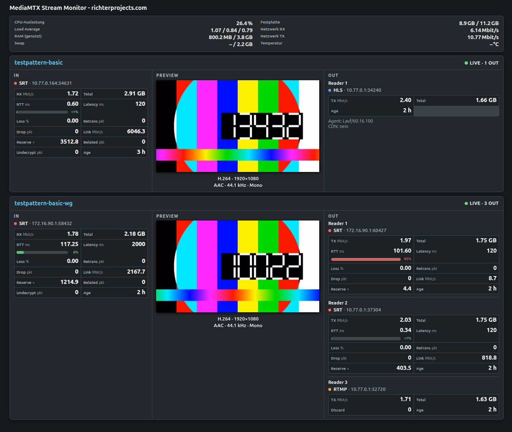

# MediaMTX Monitor

MediaMTX Monitor zeigt aktive MediaMTX-Streams, Publisher, Reader, Bitraten,
SRT-Metriken und Systemdaten in einem kleinen Web-Dashboard. Das Frontend bleibt
Vanilla JavaScript. Redis puffert die vom Collector gelesenen Daten, FastAPI
liefert API und Dashboard aus.

Der Monitoringumfang ist bewusst protokollspezifisch: SRT besitzt derzeit die
tiefste Transport- und Ereignisauswertung; für RTMP/RTMPS und RTSP/RTSPS stellt
der Monitor jeweils andere passende MediaMTX-Metriken dar, weitere Protokolle
werden überwiegend generisch dargestellt. Fehlende MediaMTX-Metriken werden
nicht durch externe Messungen gegen Publisher oder Reader ersetzt. Details
stehen im [MediaMTX-v1.20-Datenmodell](docs/MEDIAMTX_V1_20_DATA.md) und in der
[Architekturdokumentation](docs/ARCHITECTURE.md).

> **Sicherheitshinweis:** Dashboard und Monitor-API besitzen keine eingebaute
> Authentifizierung und stellen auf Port 8080 unverschlüsseltes HTTP bereit.
> Dieser Port darf nicht ungeschützt aus dem öffentlichen Internet erreichbar
> sein. MediaMTX Monitor ist für die bewusste Integration durch Betreiber in
> eine von ihnen kontrollierte Server- und Netzwerkarchitektur vorgesehen,
> beispielsweise in ein internes LAN, ein Management-VLAN, ein separates
> WireGuard- beziehungsweise Managementnetz oder hinter einen Reverse Proxy mit
> HTTPS und bei Bedarf Authentifizierung. Firewall, Zugriffsschutz, TLS und
> öffentliche Erreichbarkeit liegen in der Verantwortung des Betreibers.

Der grundlegende Datenfluss ist:

```text
MediaMTX Control API → Collector → Redis → FastAPI → Browser
```

Der Collector aktualisiert den Stream-Snapshot standardmäßig ungefähr einmal
pro Sekunde. Der Browser ruft `GET /api/streams` regelmäßig per HTTP-Polling
ab; WebSockets werden nicht verwendet. Redis hält neben aktuellen Snapshots
kurzlebigen Messzustand und eine Kurzzeithistorie für Verbindungsmetriken.



Voraussetzung ist **MediaMTX v1.20.0 oder neuer**. Der Collector prüft die
laufende Version über `/v3/info` und meldet ältere oder nicht eindeutig
erkennbare Versionen als nicht unterstützt. Details zum erfassten Datenmodell
stehen in [docs/MEDIAMTX_V1_20_DATA.md](docs/MEDIAMTX_V1_20_DATA.md).

## Dienste

MediaMTX und der Monitor laufen auf derselben Maschine als getrennte
systemd-Dienste. Ein Fehler des Monitor-Dashboards soll den laufenden
Streamingdienst nicht beenden.

| Komponente | Betrieb |
|---|---|
| MediaMTX | unabhängiger Dienst `mediamtx.service`, systemd-Standardbenutzer `root` |
| MediaMTX-Monitor | drei Dienste unter `mediamtxmon:mediamtxmon` |

Ein Ausfall von MediaMTX beendet den Collector nicht. Der Collector meldet dann
API-Fehler und fragt weiter; ein früherer erfolgreicher Snapshot kann
währenddessen als veraltet angezeigt werden. Details zur Diagnose stehen unter
[Troubleshooting](docs/TROUBLESHOOTING.md). Umgekehrt beeinflusst ein
Monitor-Ausfall den MediaMTX-Streamingdienst auf derselben Maschine nicht.

## Unterstützte Neuinstallationen

Der Installer ist für Debian-basierte Linux-Systeme mit apt, dpkg und
systemd vorgesehen, insbesondere:

- Debian  
- Ubuntu  
- Raspberry Pi OS  

Unterstützte Architekturen:

- x86_64 mit Debian-Architektur amd64  
- aarch64 mit Debian-Architektur arm64  
- 32-Bit-ARMv6 mit Debian-Architektur armhf  
- 32-Bit-ARMv7 mit Debian-Architektur armhf  

arm64 wird vom Installer unterstützt. Dazu gehören auch aktuelle
64-Bit-Installationen von Raspberry Pi OS auf einem Raspberry Pi.

32-Bit-ARM-Systeme werden erkannt und können mit den MediaMTX-Archiven
linux_armv6 beziehungsweise linux_armv7 installiert werden. Diese Systeme
wurden jedoch nicht getestet. Der Installer gibt deshalb eine Warnung aus und
setzt die Installation anschließend fort.

Nicht Debian-basierte Linux-Distributionen werden vom Installer abgelehnt.
32-Bit-x86-Systeme mit i386-/i686-Architektur werden ebenfalls abgelehnt, da
dafür kein vorgesehenes MediaMTX-Archiv existiert.

**Der Installer ist nur für frische Installationen vorgesehen. Existierende oder 
angepasste MediaMTX- oder Monitor-Installationen werden nicht überschrieben oder
aktualisiert.**

## Installation

```bash
sudo ./install.sh 1.20.0
```

Die vollständige Neuinstallation wurde mit MediaMTX v1.20.0 auf Ubuntu Server
24.04 LTS amd64 getestet. Die gewünschte MediaMTX-Version wird vom Benutzer
gewählt und muss mindestens v1.20.0 sein; ein optionales führendes `v` ist
erlaubt. Der Installer sucht nicht automatisch nach der neuesten Version.

Der Installer ermittelt:

- über /etc/os-release, ob das System Debian-basiert ist,  
- über dpkg --print-architecture die Architektur des installierten Userspace,  
- über uname -m die Maschinen- und bei 32-Bit-ARM die ARM-Version,  
- über den Benutzerparameter die zu installierende MediaMTX-Version.  

Anschließend wählt er automatisch eines der passenden MediaMTX-Archive:

- linux_amd64  
- linux_arm64  
- linux_armv6  
- linux_armv7  

Der Installer lädt Binary und vollständige `mediamtx.yml` aus demselben
offiziellen Release-Archiv und prüft dessen SHA-256-Summe. 
Er aktiviert, wenn nicht schon aktiv, API,
RTSP und WebRTC und ergänzt ausschließlich die On-Demand-Vorschauregel.  

## Installierte Komponenten und Pfade

| Inhalt | Pfad |
|---|---|
| MediaMTX-Binary | `/usr/local/bin/mediamtx` |
| MediaMTX-Konfiguration | `/usr/local/etc/mediamtx.yml` |
| Monitor | `/opt/mediamtx-monitoring-backend` |
| Monitor-Konfiguration | `/opt/mediamtx-monitoring-backend/config/collector.yaml` |
| systemd-Units | `/etc/systemd/system/mediamtx*.service` |

Zusätzlich installiert der Installer FFmpeg, Redis und eine Python-Venv mit den
Monitor-Abhängigkeiten.

## Version und Upgrade

Die installierte Monitor-Version und ein Produktions-Upgrade werden über das
mitinstallierte Kommando verwaltet:

```bash
mediamtx-monitor --version
sudo mediamtx-monitor --upgrade
```

Das Upgrade aktualisiert Programmcode, Python-Abhängigkeiten im bestehenden
venv, die CLI, die Versionsdatei und die drei systemd-Units der
Monitoring-Dienste. Die lokale `config/collector.yaml` bleibt absichtlich
unverändert: Sie ist die betreiberspezifische Laufzeitkonfiguration und gehört
dem Betreiber. Dieses Kompatibilitätsprinzip orientiert sich am Umgang von
MediaMTX mit der lokalen `mediamtx.yml`: Ein Upgrade ersetzt die vorhandene
lokale Konfiguration nicht durch die Konfigurationsvorlage einer neuen Version.

Neue optionale Monitor-Einstellungen müssen deshalb mit rückwärtskompatiblen
Standardwerten eingeführt werden. Bewusst gesetzter technischer Ausgangspunkt
des unterstützten MediaMTX-Daten- und Konfigurationsmodells ist MediaMTX
v1.20.0. Eine automatische Migration oder Ersetzung der `collector.yaml` ist
im Rahmen dieses Betreiber- und Kompatibilitätsprinzips nicht vorgesehen. Für
eine Erstinstallation ist weiterhin `install.sh` zu verwenden.

## Dienste und Benutzer

| Dienst | Benutzer | Aufgabe |
|---|---|---|
| `mediamtx.service` | root (kein `User=` in der Unit) | Streamingserver |
| `mediamtx-api.service` | `mediamtxmon` | Dashboard und Monitor-API |
| `mediamtx-collector.service` | `mediamtxmon` | MediaMTX-Control-API abfragen |
| `mediamtx-system.service` | `mediamtxmon` | Systemmetriken erfassen |
| `redis-server.service` | Distributionseinstellung | Zwischenspeicher |

Die mitgelieferte `mediamtx.service` enthält bewusst kein `User=` und folgt
damit der [offiziellen systemd-Anleitung von MediaMTX](https://mediamtx.org/docs/features/start-on-boot),
deren Vorlage ebenfalls kein `User=` enthält. Ohne diese Angabe läuft der
Dienst unter systemd standardmäßig als root; MediaMTX Monitor trifft damit
keine von MediaMTX abweichende Entscheidung über den Dienstbenutzer. Betreiber
können MediaMTX eigenverantwortlich unter einem eingeschränkten Benutzer
betreiben. Dabei müssen sie selbst alle benötigten Rechte berücksichtigen,
unter anderem für Konfiguration, automatisch erzeugte oder verwendete
Zertifikate, Aufzeichnungen, Logs, Hooks sowie weitere von der jeweiligen
MediaMTX-Konfiguration verwendete Dateien und Verzeichnisse.

## Ports

Für die mit MediaMTX v1.20.0 getestete Konfiguration:

| Port | Funktion |
|---:|---|
| 8554 | RTSP |
| 1935 | RTMP |
| 8888 | HLS |
| 8889 | WebRTC und Monitor-Vorschau |
| 8890 | SRT |
| 9997 | MediaMTX-Control-API |
| 8080/TCP | Dashboard und Monitor-API; HTTP ohne integrierte Authentifizierung, nicht ungeschützt öffentlich freigeben |
| 6379/TCP | Redis; nur lokal beziehungsweise in einem geschützten Backend-Netz erreichbar machen |

Die vollständige MediaMTX-Konfiguration stammt aus der gewählten Version; deren
Werte bleiben mit Ausnahme der dokumentierten Monitor-Anpassungen maßgeblich.

## Kurzer Funktionstest

```bash
systemctl is-active mediamtx mediamtx-api mediamtx-collector mediamtx-system
curl -fsS http://127.0.0.1:9997/v3/info | python3 -m json.tool
curl -fsS http://127.0.0.1:9997/v3/paths/list | python3 -m json.tool
curl -fsS http://127.0.0.1:8080/api/streams | python3 -m json.tool
```

Dashboard: `http://<server-ip>:8080/`

## Entwicklung und Tests

Die wichtigsten Bereiche des Repositories sind:

| Pfad | Inhalt |
|---|---|
| `bin/` | Collector, API, Systemerfassung und Backend-Hilfsmodule |
| `static/` | Vanilla-JavaScript-Dashboard und CSS |
| `config/` | Laufzeitkonfiguration und Installationsausschnitt für Preview |
| `systemd/` | Units für MediaMTX und die Monitoring-Dienste |
| `tests/` | Python-Unit-Tests und JavaScript-Renderer-Test |
| `devtools/` | kontrolliertes Deployment in die Entwicklungsinstallation |

Gemeinsamer lokaler Prüfpfad:

```bash
./devtools/verify.sh
```

## Dokumentation

- [Architektur und schrittweises Zielbild](docs/ARCHITECTURE.md)
- [Coding- und Dokumentationsstandard](docs/CODING_STYLE.md)
- [MediaMTX-v1.20-Datenmodell](docs/MEDIAMTX_V1_20_DATA.md)
- [Betrieb und Troubleshooting](docs/TROUBLESHOOTING.md)
- [Entwicklungs-Deployment](devtools/README.md)

## Lizenz

MediaMTX Monitor steht unter der [MIT-Lizenz](LICENSE).
